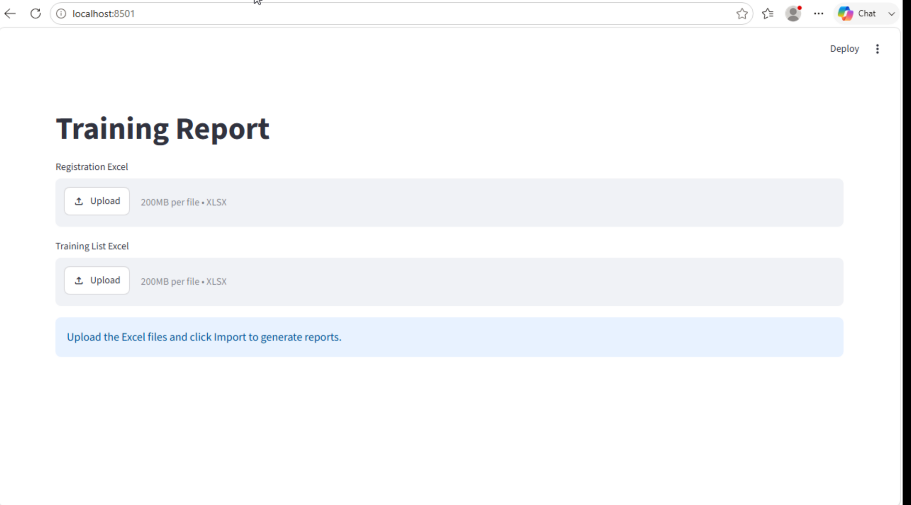
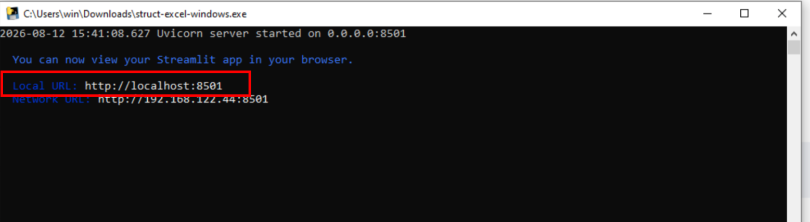
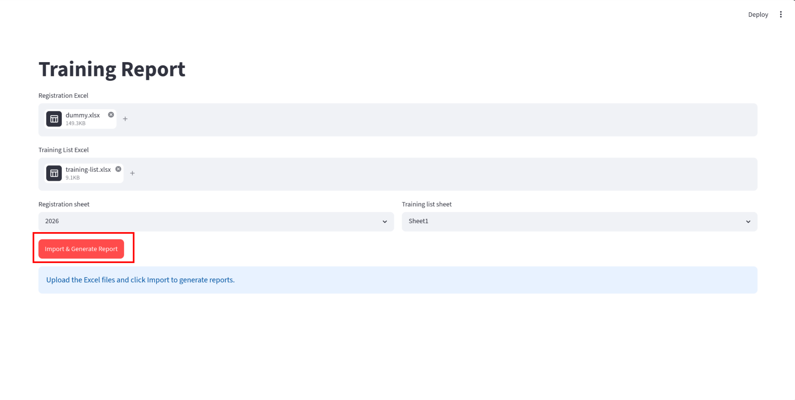
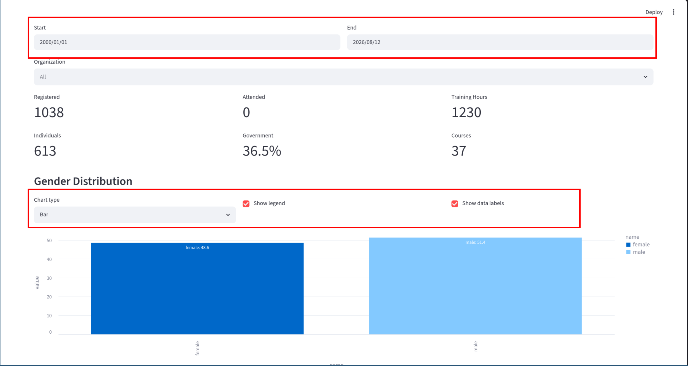
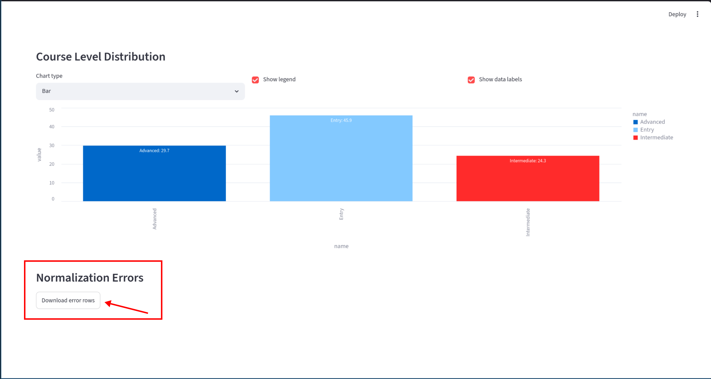
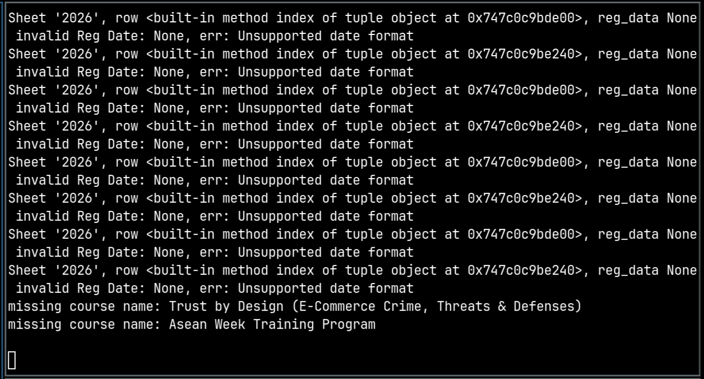

# Usage

## Report Generation

1. Execute the program. Then the program will launch the default browser.

   

   If the browser is not opened automatically, please find the URL from the terminal, and try to access the URL manually.

   

2. Upload two Excel files. One contains registration information (Full Name, Email, etc.) while the other one contains training list (Training, Level, No of Hours (Training), etc.). Then, select corresponding sheets and click `Import & Generate Report`.

   

3. The generated report supports different time range by changing `Start` and `End` field, and settings of chart are also provided to satisfy different requirements.

   

## Error Handling

Normalization errors can be downloaded from `Normalization Errors` section.

Other errors can be found from the terminal.

